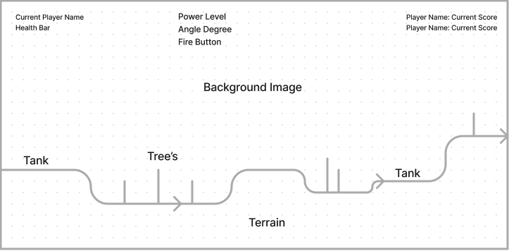

# JS-Project

Tyrant Tank
<!--- (Teeny Tiny Tank) --->

Game Background:

This is a recreation of the classic game of "Tanks". It is a turn-based game with the primary objective of destroying your opponents by blasting your way to victory. Players can navigate over the terrain in order to gain optimal positioning to defeat their opponents. The tank will be able to move left and right using their respective arrow keys and also adjust the aim/angle of fire using the up and down arrow keys. The level of power can also be adjusted before taking the shot. Points will be earned based on the number of kills and whether they come out victorious. At the end of the round, players will be able to upgrade their tank in preparation for the next round. Players will be able to challenge their friends in a duel or play against AI's of varying difficulties to prove their skills in order to be crowned the Tyrant Tank.

Functionality:

In Tyrant Tank, the users will be able to:
    - Move their tank in either direction (left or right) and navigate over the field. Using the terrain to their advantage will help to create either an optimal shooting position or defensive position.
    - Fire their cannon in the direction/angle of their choosing to damage and destroy the opponents.
    - Face off against friends or AI's with different levels of difficulty.
    - Upgrade their tank to increase their chances at winning.
    

In addition, this project will include:
    - Instructions on how to play the game.

WireFrame:

<!---  --->

Technologies, Libraries and API's:

Webpack, JavaScript, CSS, HTML
Matter.js

Timeline:

Friday Afternoon: Create the basic skeleton for the project and begin to code the background images that will be used.
Weekend: Review Canvas, resource APIs and learn physics/collision detection. Create the controls necessary for the tank.
Monday: Implement code into the project to make a basic functioning version of the game.
Tuesday: Fix up the CSS for the project including creating the tanks image.
Wednesday: Finish up any remaining parts of the project. Test to make sure its playable.